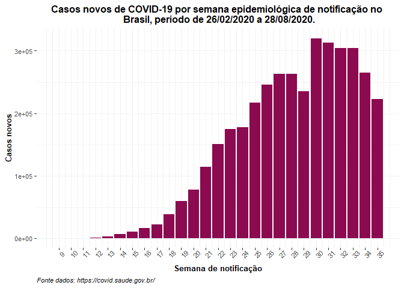
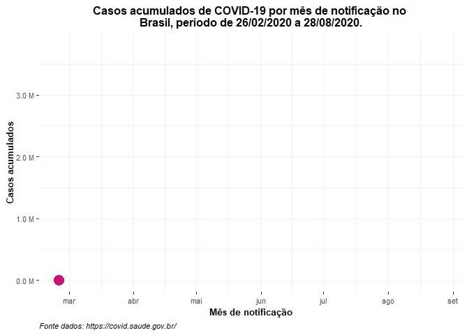
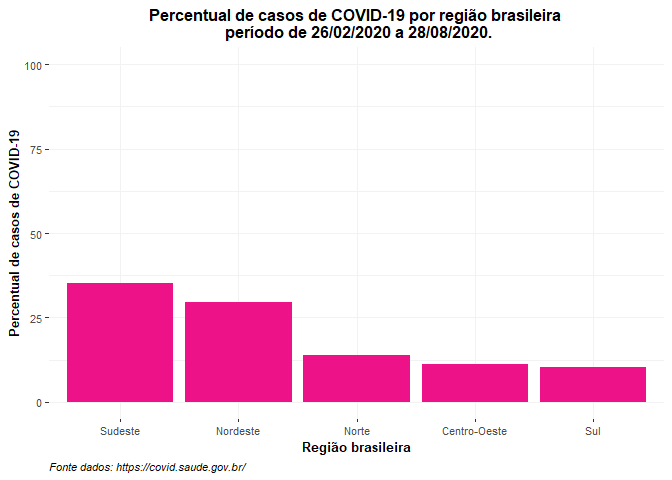
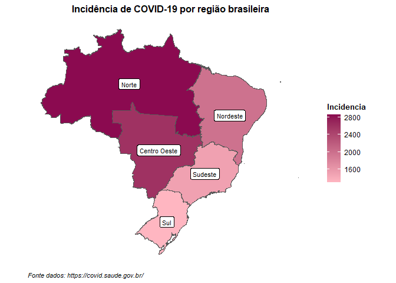

<!-- README.md is generated from README.Rmd. Please edit that file -->

# Evolução dos casos de COVID-19 no Brasil, período 26/02/2020 a 28/08/2020

<!-- badges: start -->

<!-- badges: end -->

O objetivo desta análise é avaliar a evolução dos casos de COVID-19 no
Brasil, no período de 26/02/2020 a 28/08/2020. Base de dados retirada de
<https://covid.saude.gov.br/>.

As variáveis em estudo são: região do Brasil (regiao), estado brasileiro
(estado), código do município (codmun), data de notificação (data),
semana epidemiológica de notificação(semanaEpi), tamanho da população
(populacaoTCU2019), número de casos de COVID-19 acumulado
(casosAcumulado) e número de novos casos de COVID-19 (casosNovos).

### Manipulação da base de dados

``` r
#Leitura da base
covid <- readr::read_rds("data-raw/covid.rds")

#Selecionando variáveis para resolução do problema
dados_covid <- covid %>% 
  select(regiao, estado, codmun, data, semanaEpi, populacaoTCU2019, casosAcumulado, casosNovos) %>% 
  mutate(codmun = as.numeric(codmun))

#Explorando a base
glimpse(dados_covid)
#> Rows: 869,798
#> Columns: 8
#> $ regiao           <chr> "Brasil", "Brasil", "Brasil", "Brasil", "Brasil", ...
#> $ estado           <chr> NA, NA, NA, NA, NA, NA, NA, NA, NA, NA, NA, NA, NA...
#> $ codmun           <dbl> NA, NA, NA, NA, NA, NA, NA, NA, NA, NA, NA, NA, NA...
#> $ data             <dttm> 2020-02-25, 2020-02-26, 2020-02-27, 2020-02-28, 2...
#> $ semanaEpi        <dbl> 9, 9, 9, 9, 9, 10, 10, 10, 10, 10, 10, 10, 11, 11,...
#> $ populacaoTCU2019 <dbl> 210147125, 210147125, 210147125, 210147125, 210147...
#> $ casosAcumulado   <dbl> 0, 1, 1, 1, 2, 2, 2, 2, 3, 7, 13, 19, 25, 25, 34, ...
#> $ casosNovos       <dbl> 0, 1, 0, 0, 1, 0, 0, 0, 1, 4, 6, 6, 6, 0, 9, 18, 2...
```

## Casos novos de COVID-19 no Brasil por semana epidemiológica de notificação

``` r
dados_covid %>% 
  filter(regiao=="Brasil") %>% 
  ggplot() +
  geom_col(aes(x = semanaEpi, y = casosNovos),fill="deeppink4") +
  scale_x_continuous(breaks = 9:35)+
  labs(
    x = "Semana de notificação",
    y = "Casos novos",
    title = "Casos novos de COVID-19 por semana epidemiológica de notificação no \n Brasil, período de 26/02/2020 a 28/08/2020.",
    caption = "Fonte dados: https://covid.saude.gov.br/"
  ) +
  tema_graficos() +
  theme(axis.text.x = element_text(angle=45))
```



### Casos acumulados de COVID-19 no Brasil por mês de notificação

``` r
dados_covid %>% 
  filter(regiao=="Brasil") %>% 
  mutate(casosAcumulado = casosAcumulado / 10^6) %>% 
  ggplot(aes(x = as.Date(data), y = casosAcumulado)) +
  geom_point(color="deeppink3",size=5) +
  geom_line(size=2) + 
  scale_x_date(date_breaks = "1 month", date_labels = "%b")+
  scale_y_continuous(labels = scales::unit_format(unit = "M"))+
  transition_reveal(data)+
  labs(
    x = "Mês de notificação",
    y = "Casos acumulados",
    title = "Casos acumulados de COVID-19 por mês de notificação no \n Brasil, período de 26/02/2020 a 28/08/2020.",
    caption = "Fonte dados: https://covid.saude.gov.br/"
  )+
  tema_graficos()
```



No período analisado, observa-se tendência crescente no número de casos
de COVID-19 no Brasil.

### Percentual de casos de COVID-19 por região

``` r
dados_covid %>% 
  filter(is.na(codmun) & regiao!="Brasil" ) %>% 
  group_by(regiao) %>% 
  summarise( casos = sum(casosNovos, na.rm = TRUE) ) %>% 
  mutate(freq = round( 100*(casos/sum(casos)) ,1) ) %>% 
  ggplot() +
  geom_col(aes(y= freq, 
             fct_reorder(regiao,  freq, .desc=TRUE)),fill="deeppink2")+
  ylim(0,100)+  
  labs(
    x = "Região brasileira",
    y = "Percentual de casos de COVID-19",
    title = "Percentual de casos de COVID-19 por região brasileira \n período de 26/02/2020 a 28/08/2020.",
    caption = "Fonte dados: https://covid.saude.gov.br/"
    ) +
  tema_graficos()
```



O maior percentual de casos de COVID-19 no Brasil está na região
Sudeste. Entretanto, vale ressaltar, que outros fatores, como densidade
populacional, podem influenciar este valor.

### Número de casos e incidência de covid-19 por região

``` r
tabela_casos <- dados_covid %>% 
  filter(is.na(codmun)) %>% 
  group_by(regiao) %>% 
  summarise( casos = sum(casosNovos, na.rm = TRUE) ) 


tabela_pop <- dados_covid %>%
  filter(is.na(codmun) & data == as.Date("2020-02-25") ) %>% 
  group_by(regiao) %>% 
  summarise( pop = sum(populacaoTCU2019, na.rm = TRUE)) 


##Tabela de incidência 
tabela_casos %>% 
  left_join(tabela_pop,by="regiao") %>% 
  mutate(Incidencia = (casos/pop)*100000) %>% 
  select(-pop) %>% 
  knitr::kable( col.names = c("Região","Casos", "Incidência/100mil hab."), 
                align = "ccc")
```

|    Região    |  Casos  | Incidência/100mil hab. |
| :----------: | :-----: | :--------------------: |
|    Brasil    | 3804803 |        1810.542        |
| Centro-Oeste | 423437  |        2598.239        |
|   Nordeste   | 1129019 |        1978.248        |
|    Norte     | 528587  |        2867.927        |
|   Sudeste    | 1334365 |        1509.951        |
|     Sul      | 389395  |        1299.023        |

A incidência de casos de COVID-19 no Brasil é de 1.800 casos por 100 mil
habitantes. A região com maior incidência de casos no país é a Norte. E,
as regiões com menores incidência, e inferior à do Brasil, são Sul e
Sudeste, respectivamente.

A incidência de COVID-19 por região está representada no mapa a seguir,
período analisado de 26/02/2020 a 28/08/2020.

### Mapa da incidência de COVID-19 no Brasil, por região, período de 26/02/2020 a 28/08/2020

``` r
tab_regiao <- geobr::read_region()
#>   |                                                                              |                                                                      |   0%  |                                                                              |======================================================================| 100%
#> Downloading: 10 B     Downloading: 10 B     Downloading: 16 kB     Downloading: 16 kB     Downloading: 16 kB     Downloading: 16 kB     Downloading: 32 kB     Downloading: 32 kB     Downloading: 49 kB     Downloading: 49 kB     Downloading: 65 kB     Downloading: 65 kB     Downloading: 81 kB     Downloading: 81 kB     Downloading: 97 kB     Downloading: 97 kB     Downloading: 110 kB     Downloading: 110 kB     Downloading: 120 kB     Downloading: 120 kB     Downloading: 120 kB     Downloading: 120 kB     Downloading: 130 kB     Downloading: 130 kB     Downloading: 150 kB     Downloading: 150 kB     Downloading: 150 kB     Downloading: 150 kB     Downloading: 150 kB     Downloading: 150 kB     Downloading: 150 kB     Downloading: 150 kB     Downloading: 170 kB     Downloading: 170 kB     Downloading: 190 kB     Downloading: 190 kB     Downloading: 190 kB     Downloading: 190 kB     Downloading: 210 kB     Downloading: 210 kB     Downloading: 230 kB     Downloading: 230 kB     Downloading: 230 kB     Downloading: 230 kB     Downloading: 240 kB     Downloading: 240 kB     Downloading: 240 kB     Downloading: 240 kB     Downloading: 240 kB     Downloading: 240 kB     Downloading: 250 kB     Downloading: 250 kB     Downloading: 250 kB     Downloading: 250 kB     Downloading: 250 kB     Downloading: 250 kB     Downloading: 270 kB     Downloading: 270 kB     Downloading: 280 kB     Downloading: 280 kB     Downloading: 300 kB     Downloading: 300 kB     Downloading: 320 kB     Downloading: 320 kB     Downloading: 320 kB     Downloading: 320 kB     Downloading: 320 kB     Downloading: 320 kB     Downloading: 320 kB     Downloading: 320 kB     Downloading: 340 kB     Downloading: 340 kB     Downloading: 360 kB     Downloading: 360 kB     Downloading: 370 kB     Downloading: 370 kB     Downloading: 390 kB     Downloading: 390 kB     Downloading: 400 kB     Downloading: 400 kB     Downloading: 420 kB     Downloading: 420 kB     Downloading: 440 kB     Downloading: 440 kB     Downloading: 450 kB     Downloading: 450 kB     Downloading: 470 kB     Downloading: 470 kB     Downloading: 490 kB     Downloading: 490 kB     Downloading: 500 kB     Downloading: 500 kB     Downloading: 520 kB     Downloading: 520 kB     Downloading: 530 kB     Downloading: 530 kB     Downloading: 550 kB     Downloading: 550 kB     Downloading: 570 kB     Downloading: 570 kB     Downloading: 580 kB     Downloading: 580 kB     Downloading: 600 kB     Downloading: 600 kB     Downloading: 620 kB     Downloading: 620 kB     Downloading: 630 kB     Downloading: 630 kB     Downloading: 650 kB     Downloading: 650 kB     Downloading: 660 kB     Downloading: 660 kB     Downloading: 660 kB     Downloading: 660 kB     Downloading: 660 kB     Downloading: 660 kB     Downloading: 660 kB     Downloading: 660 kB     Downloading: 660 kB     Downloading: 660 kB     Downloading: 660 kB     Downloading: 660 kB     Downloading: 670 kB     Downloading: 670 kB     Downloading: 670 kB     Downloading: 670 kB     Downloading: 690 kB     Downloading: 690 kB     Downloading: 700 kB     Downloading: 700 kB     Downloading: 720 kB     Downloading: 720 kB     Downloading: 740 kB     Downloading: 740 kB     Downloading: 750 kB     Downloading: 750 kB     Downloading: 770 kB     Downloading: 770 kB     Downloading: 780 kB     Downloading: 780 kB     Downloading: 780 kB     Downloading: 780 kB

tab_covid <- tabela_casos %>% 
  left_join(tabela_pop,by="regiao") %>% 
  mutate(Incidencia = (casos/pop)*100000) %>% 
  select(-pop) 

tab_covid$regiao[2] <- "Centro Oeste"

tab_covid_regiao <- tab_covid %>%
  right_join(tab_regiao, by = c("regiao" = "name_region"))


tab_covid_regiao %>%
  ggplot() +
  geom_sf(aes(geometry = geom, fill = Incidencia)) +
  geom_sf_label(aes(geometry = geom, label = regiao), size = 3)+
  scale_fill_gradient(low = "lightpink", high = "deeppink4") +
  labs(title = "Incidência de COVID-19 por região brasileira",
       caption = "Fonte dados: https://covid.saude.gov.br/"
       ) +
    theme(
       panel.background = element_rect(fill = "white"),
       panel.grid.major.y = element_blank(),
       panel.grid.minor = element_blank(),
       panel.grid.major.x = element_blank(),
       legend.position = "right",
       axis.text.x = element_blank(),
       axis.text.y = element_blank(),
       axis.ticks = element_blank(),
       axis.title = element_blank(),
       plot.title = element_text(hjust = 0.5),
       title = element_text(face = "bold", size = 10),
       plot.caption = element_text(face = "italic",hjust = 0)
    )
```



Introdução a análise e visualização de dados usando o R

Profa. Dra. Camila Bertini Martins, e-mail: <cb.martins@unifesp.br>,
UNIFESP, EPM, Departamento de Medicina Preventiva, Área de Epidemilogia
e Bioestatística
